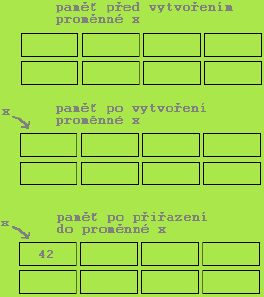

# Proměnné

- Proměnná je pojmenované místo v paměti
- Slouží k uchování hodnoty za běhu programu
- Každá proměnná má jméno a datový typ
	- Pomocí jména se na proměnnou odkazujeme
	- Datový typ udává, jaké hodnoty můžeme do proměnné ukládat (př. reálná čísla, řetězce, ...)



## Zápis

- Konvence a syntaxe zápisu
	- Název začíná vždy malým písmenem nebo podtržítkem
	- Název nesmí začínat číslovkou (ale později v názvu již může být použita)
	- V případě, že je název tvořen více slovy, začíná každé slovo velkým písmenem
	-  Př. `pocet2`, `pocetPrvku`
- Deklarace
	- Proměnnou je nutno před prvním použitím deklarovat (definovat), tj. stanovit jméno a datový typ (do paměti se uloží automaticky)
```java
int cislo;
char znak1, znak2;
```

## Přiřazení hodnoty

- Hodnotu uložíme do proměnné operátorem přiřazení → proměnná = výraz (hodnota);
```java
cislo = 42;
```
- První přiřazení do proměnné nazýváme **inicializace**
- Inicializaci proměnné je možné spojit s její deklarací
```java
int cislo = 42;
```
- Inicializace musí proběhnout před prvním čtením!
```java
int i;
int j;
j = i + 2;//chyba při překladu
```

## Deklarace proměnných

- **Doporučení**
- Každá proměnná by měla být deklarována na samostatné řádce a okomentovaná
```java
double celkemPlat; //celkový plat
```
- Pozn.: Je povoleno deklarovat více proměnných na jeden řádek 
```java
int i, j;
```
- Každá explicitně inicializovaná proměnná by měla být deklarována samostatně
```java
int i;
int j = 1;
```
- Mezi deklaracemi proměnných a dalšími příkazy je vhodné mít prázdnou řádku kvůli přehlednosti

## Operátor přiřazení

- Pozor na následující terminologii

| Výraz     | i * 2 + 3        |
| --------- | ---------------- |
| Přiřazení | j = i * 2 + 3    |
| Příkaz    | `j = i * 2 + 3;` |

- To znamená:
	- Výraz má vždy hodnotu (číselnou, znakovou nebo pravdivostní)
	- Přiřazení je výraz a jeho hodnotou je hodnota přiřazená levé straně
	- Přiřazení se stává příkazem, je-li ukončeno středníkem